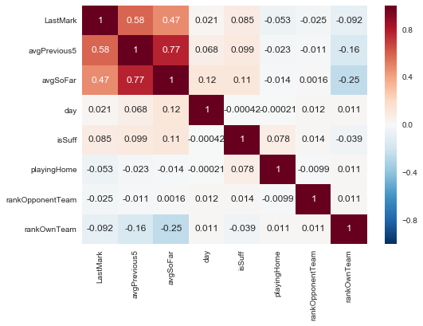
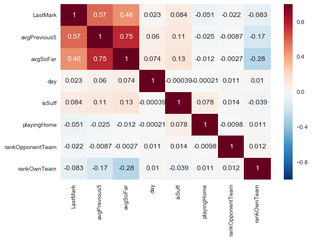
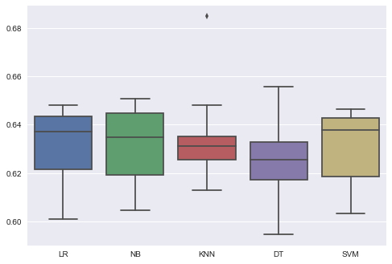
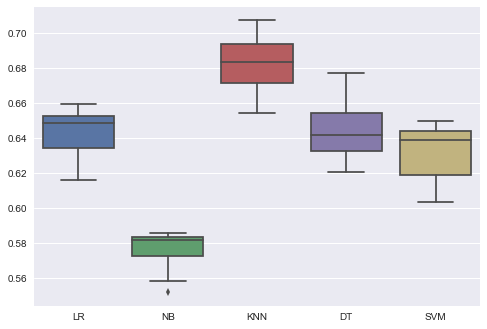
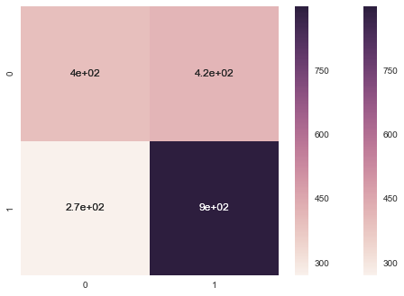

This is the second part of the Fantasy Football project. This is a preliminary version with very promising results.
In the next hours I will enrich it with comments and explanation.


```python
#import

import pandas as pd
import numpy as np
import matplotlib.pyplot as plt
marks_final= pd.read_csv('dataset_2015_marks.csv', index_col=0)
from sklearn.feature_selection import SelectKBest
from sklearn.feature_selection import chi2
```


```python
marks_final.rename(columns = {'LastMark':'lastMark'})
```


<div>
<table border="1" class="dataframe">
  <thead>
    <tr style="text-align: right;">
      <th></th>
      <th>player</th>
      <th>name</th>
      <th>team</th>
      <th>day</th>
      <th>goal</th>
      <th>penalty</th>
      <th>owngoal</th>
      <th>mark</th>
      <th>rankOwnTeam</th>
      <th>playingHome</th>
      <th>opponentTeam</th>
      <th>rankOpponentTeam</th>
      <th>avgPrevious5</th>
      <th>avgSoFar</th>
      <th>lastMark</th>
      <th>isSuff</th>
    </tr>
  </thead>
  <tbody>
    <tr>
      <th>0</th>
      <td>2247</td>
      <td>Sportiello</td>
      <td>Atalanta</td>
      <td>1</td>
      <td>0</td>
      <td>0</td>
      <td>0</td>
      <td>7.0</td>
      <td>10</td>
      <td>1</td>
      <td>Verona</td>
      <td>10</td>
      <td>NaN</td>
      <td>NaN</td>
      <td>NaN</td>
      <td>1</td>
    </tr>
    <tr>
      <th>1</th>
      <td>2247</td>
      <td>Sportiello</td>
      <td>Atalanta</td>
      <td>2</td>
      <td>0</td>
      <td>0</td>
      <td>0</td>
      <td>7.5</td>
      <td>10</td>
      <td>0</td>
      <td>Cagliari</td>
      <td>10</td>
      <td>7.000000</td>
      <td>7.000000</td>
      <td>7.0</td>
      <td>1</td>
    </tr>
    <tr>
      <th>2</th>
      <td>2247</td>
      <td>Sportiello</td>
      <td>Atalanta</td>
      <td>3</td>
      <td>0</td>
      <td>0</td>
      <td>0</td>
      <td>6.0</td>
      <td>5</td>
      <td>1</td>
      <td>Fiorentina</td>
      <td>15</td>
      <td>7.250000</td>
      <td>7.250000</td>
      <td>7.5</td>
      <td>1</td>
    </tr>
    <tr>
      <th>3</th>
      <td>2247</td>
      <td>Sportiello</td>
      <td>Atalanta</td>
      <td>4</td>
      <td>0</td>
      <td>0</td>
      <td>0</td>
      <td>6.5</td>
      <td>9</td>
      <td>0</td>
      <td>Inter</td>
      <td>6</td>
      <td>6.833333</td>
      <td>6.833333</td>
      <td>6.0</td>
      <td>1</td>
    </tr>
    <tr>
      <th>4</th>
      <td>2247</td>
      <td>Sportiello</td>
      <td>Atalanta</td>
      <td>5</td>
      <td>0</td>
      <td>0</td>
      <td>0</td>
      <td>5.0</td>
      <td>11</td>
      <td>1</td>
      <td>Juventus</td>
      <td>1</td>
      <td>6.750000</td>
      <td>6.750000</td>
      <td>6.5</td>
      <td>0</td>
    </tr>
    <tr>
      <th>5</th>
      <td>2247</td>
      <td>Sportiello</td>
      <td>Atalanta</td>
      <td>6</td>
      <td>0</td>
      <td>0</td>
      <td>0</td>
      <td>6.5</td>
      <td>15</td>
      <td>0</td>
      <td>Sampdoria</td>
      <td>4</td>
      <td>6.400000</td>
      <td>6.400000</td>
      <td>5.0</td>
      <td>1</td>
    </tr>
    <tr>
      <th>6</th>
      <td>2247</td>
      <td>Sportiello</td>
      <td>Atalanta</td>
      <td>7</td>
      <td>0</td>
      <td>0</td>
      <td>0</td>
      <td>6.0</td>
      <td>16</td>
      <td>1</td>
      <td>Parma</td>
      <td>19</td>
      <td>6.300000</td>
      <td>6.416667</td>
      <td>6.5</td>
      <td>1</td>
    </tr>
    <tr>
      <th>7</th>
      <td>2247</td>
      <td>Sportiello</td>
      <td>Atalanta</td>
      <td>8</td>
      <td>0</td>
      <td>0</td>
      <td>0</td>
      <td>6.0</td>
      <td>13</td>
      <td>0</td>
      <td>Udinese</td>
      <td>5</td>
      <td>6.000000</td>
      <td>6.357143</td>
      <td>6.0</td>
      <td>1</td>
    </tr>
    <tr>
      <th>8</th>
      <td>2247</td>
      <td>Sportiello</td>
      <td>Atalanta</td>
      <td>9</td>
      <td>0</td>
      <td>0</td>
      <td>0</td>
      <td>8.0</td>
      <td>15</td>
      <td>1</td>
      <td>Napoli</td>
      <td>7</td>
      <td>6.000000</td>
      <td>6.312500</td>
      <td>6.0</td>
      <td>1</td>
    </tr>
    <tr>
      <th>9</th>
      <td>2247</td>
      <td>Sportiello</td>
      <td>Atalanta</td>
      <td>10</td>
      <td>0</td>
      <td>0</td>
      <td>0</td>
      <td>6.5</td>
      <td>16</td>
      <td>0</td>
      <td>Torino</td>
      <td>12</td>
      <td>6.300000</td>
      <td>6.500000</td>
      <td>8.0</td>
      <td>1</td>
    </tr>
    <tr>
      <th>10</th>
      <td>2247</td>
      <td>Sportiello</td>
      <td>Atalanta</td>
      <td>11</td>
      <td>0</td>
      <td>0</td>
      <td>0</td>
      <td>7.0</td>
      <td>15</td>
      <td>0</td>
      <td>Sassuolo</td>
      <td>14</td>
      <td>6.600000</td>
      <td>6.500000</td>
      <td>6.5</td>
      <td>1</td>
    </tr>
    <tr>
      <th>11</th>
      <td>2247</td>
      <td>Sportiello</td>
      <td>Atalanta</td>
      <td>12</td>
      <td>0</td>
      <td>0</td>
      <td>0</td>
      <td>6.0</td>
      <td>16</td>
      <td>1</td>
      <td>Roma</td>
      <td>2</td>
      <td>6.700000</td>
      <td>6.545455</td>
      <td>7.0</td>
      <td>1</td>
    </tr>
    <tr>
      <th>12</th>
      <td>2247</td>
      <td>Sportiello</td>
      <td>Atalanta</td>
      <td>13</td>
      <td>0</td>
      <td>0</td>
      <td>0</td>
      <td>7.5</td>
      <td>17</td>
      <td>0</td>
      <td>Empoli</td>
      <td>14</td>
      <td>6.700000</td>
      <td>6.500000</td>
      <td>6.0</td>
      <td>1</td>
    </tr>
    <tr>
      <th>13</th>
      <td>2247</td>
      <td>Sportiello</td>
      <td>Atalanta</td>
      <td>14</td>
      <td>0</td>
      <td>0</td>
      <td>0</td>
      <td>6.0</td>
      <td>16</td>
      <td>1</td>
      <td>Cesena</td>
      <td>19</td>
      <td>7.000000</td>
      <td>6.576923</td>
      <td>7.5</td>
      <td>1</td>
    </tr>
    <tr>
      <th>14</th>
      <td>2247</td>
      <td>Sportiello</td>
      <td>Atalanta</td>
      <td>15</td>
      <td>0</td>
      <td>0</td>
      <td>0</td>
      <td>6.5</td>
      <td>14</td>
      <td>0</td>
      <td>Lazio</td>
      <td>6</td>
      <td>6.600000</td>
      <td>6.535714</td>
      <td>6.0</td>
      <td>1</td>
    </tr>
    <tr>
      <th>15</th>
      <td>2247</td>
      <td>Sportiello</td>
      <td>Atalanta</td>
      <td>16</td>
      <td>0</td>
      <td>0</td>
      <td>0</td>
      <td>5.5</td>
      <td>15</td>
      <td>1</td>
      <td>Palermo</td>
      <td>9</td>
      <td>6.600000</td>
      <td>6.533333</td>
      <td>6.5</td>
      <td>0</td>
    </tr>
    <tr>
      <th>16</th>
      <td>2247</td>
      <td>Sportiello</td>
      <td>Atalanta</td>
      <td>17</td>
      <td>0</td>
      <td>0</td>
      <td>0</td>
      <td>6.5</td>
      <td>17</td>
      <td>0</td>
      <td>Genoa</td>
      <td>6</td>
      <td>6.300000</td>
      <td>6.468750</td>
      <td>5.5</td>
      <td>1</td>
    </tr>
    <tr>
      <th>17</th>
      <td>2247</td>
      <td>Sportiello</td>
      <td>Atalanta</td>
      <td>18</td>
      <td>0</td>
      <td>0</td>
      <td>0</td>
      <td>7.0</td>
      <td>17</td>
      <td>1</td>
      <td>Chievo</td>
      <td>16</td>
      <td>6.400000</td>
      <td>6.470588</td>
      <td>6.5</td>
      <td>1</td>
    </tr>
    <tr>
      <th>18</th>
      <td>2247</td>
      <td>Sportiello</td>
      <td>Atalanta</td>
      <td>19</td>
      <td>0</td>
      <td>0</td>
      <td>0</td>
      <td>6.0</td>
      <td>17</td>
      <td>0</td>
      <td>Milan</td>
      <td>8</td>
      <td>6.300000</td>
      <td>6.500000</td>
      <td>7.0</td>
      <td>1</td>
    </tr>
    <tr>
      <th>19</th>
      <td>2247</td>
      <td>Sportiello</td>
      <td>Atalanta</td>
      <td>20</td>
      <td>0</td>
      <td>0</td>
      <td>0</td>
      <td>6.5</td>
      <td>15</td>
      <td>0</td>
      <td>Verona</td>
      <td>14</td>
      <td>6.300000</td>
      <td>6.473684</td>
      <td>6.0</td>
      <td>1</td>
    </tr>
    <tr>
      <th>20</th>
      <td>2247</td>
      <td>Sportiello</td>
      <td>Atalanta</td>
      <td>21</td>
      <td>0</td>
      <td>0</td>
      <td>0</td>
      <td>6.5</td>
      <td>15</td>
      <td>1</td>
      <td>Cagliari</td>
      <td>16</td>
      <td>6.300000</td>
      <td>6.475000</td>
      <td>6.5</td>
      <td>1</td>
    </tr>
    <tr>
      <th>21</th>
      <td>2247</td>
      <td>Sportiello</td>
      <td>Atalanta</td>
      <td>22</td>
      <td>0</td>
      <td>0</td>
      <td>0</td>
      <td>6.0</td>
      <td>15</td>
      <td>0</td>
      <td>Fiorentina</td>
      <td>6</td>
      <td>6.500000</td>
      <td>6.476190</td>
      <td>6.5</td>
      <td>1</td>
    </tr>
    <tr>
      <th>22</th>
      <td>2247</td>
      <td>Sportiello</td>
      <td>Atalanta</td>
      <td>23</td>
      <td>0</td>
      <td>0</td>
      <td>0</td>
      <td>5.5</td>
      <td>15</td>
      <td>1</td>
      <td>Inter</td>
      <td>11</td>
      <td>6.400000</td>
      <td>6.454545</td>
      <td>6.0</td>
      <td>0</td>
    </tr>
    <tr>
      <th>23</th>
      <td>2247</td>
      <td>Sportiello</td>
      <td>Atalanta</td>
      <td>24</td>
      <td>0</td>
      <td>0</td>
      <td>0</td>
      <td>7.0</td>
      <td>17</td>
      <td>0</td>
      <td>Juventus</td>
      <td>1</td>
      <td>6.100000</td>
      <td>6.413043</td>
      <td>5.5</td>
      <td>1</td>
    </tr>
    <tr>
      <th>24</th>
      <td>2247</td>
      <td>Sportiello</td>
      <td>Atalanta</td>
      <td>25</td>
      <td>0</td>
      <td>0</td>
      <td>0</td>
      <td>5.0</td>
      <td>17</td>
      <td>1</td>
      <td>Sampdoria</td>
      <td>6</td>
      <td>6.300000</td>
      <td>6.437500</td>
      <td>7.0</td>
      <td>0</td>
    </tr>
    <tr>
      <th>25</th>
      <td>2247</td>
      <td>Sportiello</td>
      <td>Atalanta</td>
      <td>26</td>
      <td>0</td>
      <td>0</td>
      <td>0</td>
      <td>7.0</td>
      <td>17</td>
      <td>0</td>
      <td>Parma</td>
      <td>20</td>
      <td>6.000000</td>
      <td>6.380000</td>
      <td>5.0</td>
      <td>1</td>
    </tr>
    <tr>
      <th>26</th>
      <td>2247</td>
      <td>Sportiello</td>
      <td>Atalanta</td>
      <td>27</td>
      <td>0</td>
      <td>0</td>
      <td>0</td>
      <td>6.0</td>
      <td>17</td>
      <td>1</td>
      <td>Udinese</td>
      <td>12</td>
      <td>6.100000</td>
      <td>6.403846</td>
      <td>7.0</td>
      <td>1</td>
    </tr>
    <tr>
      <th>27</th>
      <td>2247</td>
      <td>Sportiello</td>
      <td>Atalanta</td>
      <td>28</td>
      <td>0</td>
      <td>0</td>
      <td>0</td>
      <td>6.5</td>
      <td>17</td>
      <td>0</td>
      <td>Napoli</td>
      <td>4</td>
      <td>6.100000</td>
      <td>6.388889</td>
      <td>6.0</td>
      <td>1</td>
    </tr>
    <tr>
      <th>28</th>
      <td>2247</td>
      <td>Sportiello</td>
      <td>Atalanta</td>
      <td>29</td>
      <td>0</td>
      <td>0</td>
      <td>0</td>
      <td>5.5</td>
      <td>17</td>
      <td>1</td>
      <td>Torino</td>
      <td>8</td>
      <td>6.300000</td>
      <td>6.392857</td>
      <td>6.5</td>
      <td>0</td>
    </tr>
    <tr>
      <th>29</th>
      <td>2247</td>
      <td>Sportiello</td>
      <td>Atalanta</td>
      <td>30</td>
      <td>0</td>
      <td>0</td>
      <td>0</td>
      <td>6.0</td>
      <td>17</td>
      <td>1</td>
      <td>Sassuolo</td>
      <td>11</td>
      <td>6.000000</td>
      <td>6.362069</td>
      <td>5.5</td>
      <td>1</td>
    </tr>
    <tr>
      <th>...</th>
      <td>...</td>
      <td>...</td>
      <td>...</td>
      <td>...</td>
      <td>...</td>
      <td>...</td>
      <td>...</td>
      <td>...</td>
      <td>...</td>
      <td>...</td>
      <td>...</td>
      <td>...</td>
      <td>...</td>
      <td>...</td>
      <td>...</td>
      <td>...</td>
    </tr>
    <tr>
      <th>9874</th>
      <td>2794</td>
      <td>Gnoukouri</td>
      <td>Inter</td>
      <td>31</td>
      <td>0</td>
      <td>0</td>
      <td>0</td>
      <td>6.5</td>
      <td>10</td>
      <td>1</td>
      <td>Milan</td>
      <td>9</td>
      <td>NaN</td>
      <td>NaN</td>
      <td>NaN</td>
      <td>1</td>
    </tr>
    <tr>
      <th>9875</th>
      <td>2794</td>
      <td>Gnoukouri</td>
      <td>Inter</td>
      <td>32</td>
      <td>0</td>
      <td>0</td>
      <td>0</td>
      <td>6.5</td>
      <td>10</td>
      <td>1</td>
      <td>Roma</td>
      <td>2</td>
      <td>6.500000</td>
      <td>6.500000</td>
      <td>6.5</td>
      <td>1</td>
    </tr>
    <tr>
      <th>9876</th>
      <td>2797</td>
      <td>Dal Monte</td>
      <td>Cesena</td>
      <td>32</td>
      <td>0</td>
      <td>0</td>
      <td>0</td>
      <td>5.5</td>
      <td>18</td>
      <td>0</td>
      <td>Genoa</td>
      <td>7</td>
      <td>NaN</td>
      <td>NaN</td>
      <td>NaN</td>
      <td>0</td>
    </tr>
    <tr>
      <th>9877</th>
      <td>2797</td>
      <td>Dal Monte</td>
      <td>Cesena</td>
      <td>34</td>
      <td>0</td>
      <td>0</td>
      <td>0</td>
      <td>5.5</td>
      <td>18</td>
      <td>0</td>
      <td>Fiorentina</td>
      <td>7</td>
      <td>5.500000</td>
      <td>5.500000</td>
      <td>NaN</td>
      <td>0</td>
    </tr>
    <tr>
      <th>9878</th>
      <td>2797</td>
      <td>Dal Monte</td>
      <td>Cesena</td>
      <td>37</td>
      <td>0</td>
      <td>0</td>
      <td>0</td>
      <td>6.0</td>
      <td>19</td>
      <td>1</td>
      <td>Cagliari</td>
      <td>18</td>
      <td>5.500000</td>
      <td>5.500000</td>
      <td>NaN</td>
      <td>1</td>
    </tr>
    <tr>
      <th>9879</th>
      <td>2798</td>
      <td>Ujkani</td>
      <td>Palermo</td>
      <td>32</td>
      <td>0</td>
      <td>0</td>
      <td>0</td>
      <td>6.0</td>
      <td>11</td>
      <td>0</td>
      <td>Parma</td>
      <td>20</td>
      <td>NaN</td>
      <td>NaN</td>
      <td>NaN</td>
      <td>1</td>
    </tr>
    <tr>
      <th>9880</th>
      <td>2798</td>
      <td>Ujkani</td>
      <td>Palermo</td>
      <td>34</td>
      <td>0</td>
      <td>0</td>
      <td>0</td>
      <td>6.0</td>
      <td>11</td>
      <td>0</td>
      <td>Sassuolo</td>
      <td>16</td>
      <td>6.000000</td>
      <td>6.000000</td>
      <td>NaN</td>
      <td>1</td>
    </tr>
    <tr>
      <th>9881</th>
      <td>2798</td>
      <td>Ujkani</td>
      <td>Palermo</td>
      <td>35</td>
      <td>0</td>
      <td>0</td>
      <td>0</td>
      <td>5.5</td>
      <td>10</td>
      <td>1</td>
      <td>Atalanta</td>
      <td>17</td>
      <td>6.000000</td>
      <td>6.000000</td>
      <td>6.0</td>
      <td>0</td>
    </tr>
    <tr>
      <th>9882</th>
      <td>2799</td>
      <td>Barella</td>
      <td>Cagliari</td>
      <td>34</td>
      <td>0</td>
      <td>0</td>
      <td>0</td>
      <td>6.0</td>
      <td>18</td>
      <td>1</td>
      <td>Parma</td>
      <td>20</td>
      <td>NaN</td>
      <td>NaN</td>
      <td>NaN</td>
      <td>1</td>
    </tr>
    <tr>
      <th>9883</th>
      <td>2799</td>
      <td>Barella</td>
      <td>Cagliari</td>
      <td>37</td>
      <td>0</td>
      <td>0</td>
      <td>0</td>
      <td>6.0</td>
      <td>18</td>
      <td>0</td>
      <td>Cesena</td>
      <td>19</td>
      <td>6.000000</td>
      <td>6.000000</td>
      <td>NaN</td>
      <td>1</td>
    </tr>
    <tr>
      <th>9884</th>
      <td>2799</td>
      <td>Barella</td>
      <td>Cagliari</td>
      <td>38</td>
      <td>0</td>
      <td>0</td>
      <td>0</td>
      <td>7.0</td>
      <td>18</td>
      <td>1</td>
      <td>Udinese</td>
      <td>16</td>
      <td>6.000000</td>
      <td>6.000000</td>
      <td>6.0</td>
      <td>1</td>
    </tr>
    <tr>
      <th>9885</th>
      <td>2802</td>
      <td>Fontanesi</td>
      <td>Sassuolo</td>
      <td>34</td>
      <td>0</td>
      <td>0</td>
      <td>0</td>
      <td>6.0</td>
      <td>16</td>
      <td>1</td>
      <td>Palermo</td>
      <td>11</td>
      <td>NaN</td>
      <td>NaN</td>
      <td>NaN</td>
      <td>1</td>
    </tr>
    <tr>
      <th>9886</th>
      <td>2802</td>
      <td>Fontanesi</td>
      <td>Sassuolo</td>
      <td>36</td>
      <td>0</td>
      <td>0</td>
      <td>0</td>
      <td>6.5</td>
      <td>16</td>
      <td>1</td>
      <td>Milan</td>
      <td>10</td>
      <td>6.000000</td>
      <td>6.000000</td>
      <td>NaN</td>
      <td>1</td>
    </tr>
    <tr>
      <th>9887</th>
      <td>2802</td>
      <td>Fontanesi</td>
      <td>Sassuolo</td>
      <td>37</td>
      <td>0</td>
      <td>0</td>
      <td>0</td>
      <td>6.0</td>
      <td>13</td>
      <td>0</td>
      <td>Udinese</td>
      <td>15</td>
      <td>6.250000</td>
      <td>6.250000</td>
      <td>6.5</td>
      <td>1</td>
    </tr>
    <tr>
      <th>9888</th>
      <td>2803</td>
      <td>Avramov</td>
      <td>Atalanta</td>
      <td>35</td>
      <td>0</td>
      <td>0</td>
      <td>0</td>
      <td>5.0</td>
      <td>17</td>
      <td>0</td>
      <td>Palermo</td>
      <td>10</td>
      <td>NaN</td>
      <td>NaN</td>
      <td>NaN</td>
      <td>0</td>
    </tr>
    <tr>
      <th>9889</th>
      <td>2804</td>
      <td>Frezzolini</td>
      <td>Atalanta</td>
      <td>35</td>
      <td>0</td>
      <td>0</td>
      <td>0</td>
      <td>6.5</td>
      <td>17</td>
      <td>0</td>
      <td>Palermo</td>
      <td>10</td>
      <td>NaN</td>
      <td>NaN</td>
      <td>NaN</td>
      <td>1</td>
    </tr>
    <tr>
      <th>9890</th>
      <td>2795</td>
      <td>Vitale</td>
      <td>Juventus</td>
      <td>35</td>
      <td>0</td>
      <td>0</td>
      <td>0</td>
      <td>6.0</td>
      <td>1</td>
      <td>1</td>
      <td>Cagliari</td>
      <td>18</td>
      <td>NaN</td>
      <td>NaN</td>
      <td>NaN</td>
      <td>1</td>
    </tr>
    <tr>
      <th>9891</th>
      <td>2746</td>
      <td>Djordjevic L.</td>
      <td>Sampdoria</td>
      <td>35</td>
      <td>0</td>
      <td>0</td>
      <td>0</td>
      <td>6.0</td>
      <td>6</td>
      <td>0</td>
      <td>Udinese</td>
      <td>13</td>
      <td>NaN</td>
      <td>NaN</td>
      <td>NaN</td>
      <td>1</td>
    </tr>
    <tr>
      <th>9892</th>
      <td>2746</td>
      <td>Djordjevic L.</td>
      <td>Sampdoria</td>
      <td>37</td>
      <td>0</td>
      <td>0</td>
      <td>0</td>
      <td>5.0</td>
      <td>7</td>
      <td>0</td>
      <td>Empoli</td>
      <td>15</td>
      <td>6.000000</td>
      <td>6.000000</td>
      <td>NaN</td>
      <td>0</td>
    </tr>
    <tr>
      <th>9893</th>
      <td>2807</td>
      <td>Rosseti</td>
      <td>Atalanta</td>
      <td>37</td>
      <td>0</td>
      <td>0</td>
      <td>0</td>
      <td>6.0</td>
      <td>17</td>
      <td>0</td>
      <td>Chievo</td>
      <td>14</td>
      <td>NaN</td>
      <td>NaN</td>
      <td>NaN</td>
      <td>1</td>
    </tr>
    <tr>
      <th>9894</th>
      <td>2808</td>
      <td>Mastalli</td>
      <td>Milan</td>
      <td>37</td>
      <td>0</td>
      <td>0</td>
      <td>0</td>
      <td>6.0</td>
      <td>10</td>
      <td>1</td>
      <td>Torino</td>
      <td>9</td>
      <td>NaN</td>
      <td>NaN</td>
      <td>NaN</td>
      <td>1</td>
    </tr>
    <tr>
      <th>9895</th>
      <td>2810</td>
      <td>Rosso</td>
      <td>Torino</td>
      <td>37</td>
      <td>0</td>
      <td>0</td>
      <td>0</td>
      <td>6.0</td>
      <td>9</td>
      <td>0</td>
      <td>Milan</td>
      <td>10</td>
      <td>NaN</td>
      <td>NaN</td>
      <td>NaN</td>
      <td>1</td>
    </tr>
    <tr>
      <th>9896</th>
      <td>2810</td>
      <td>Rosso</td>
      <td>Torino</td>
      <td>38</td>
      <td>0</td>
      <td>0</td>
      <td>0</td>
      <td>6.0</td>
      <td>9</td>
      <td>1</td>
      <td>Cesena</td>
      <td>20</td>
      <td>6.000000</td>
      <td>6.000000</td>
      <td>6.0</td>
      <td>1</td>
    </tr>
    <tr>
      <th>9897</th>
      <td>2811</td>
      <td>Scuffet</td>
      <td>Udinese</td>
      <td>37</td>
      <td>0</td>
      <td>0</td>
      <td>0</td>
      <td>6.5</td>
      <td>15</td>
      <td>1</td>
      <td>Sassuolo</td>
      <td>13</td>
      <td>NaN</td>
      <td>NaN</td>
      <td>NaN</td>
      <td>1</td>
    </tr>
    <tr>
      <th>9898</th>
      <td>2811</td>
      <td>Scuffet</td>
      <td>Udinese</td>
      <td>38</td>
      <td>0</td>
      <td>0</td>
      <td>0</td>
      <td>5.5</td>
      <td>16</td>
      <td>0</td>
      <td>Cagliari</td>
      <td>18</td>
      <td>6.500000</td>
      <td>6.500000</td>
      <td>6.5</td>
      <td>0</td>
    </tr>
    <tr>
      <th>9899</th>
      <td>2812</td>
      <td>Bressan</td>
      <td>Cesena</td>
      <td>38</td>
      <td>0</td>
      <td>0</td>
      <td>0</td>
      <td>5.5</td>
      <td>20</td>
      <td>0</td>
      <td>Torino</td>
      <td>9</td>
      <td>NaN</td>
      <td>NaN</td>
      <td>NaN</td>
      <td>0</td>
    </tr>
    <tr>
      <th>9900</th>
      <td>2817</td>
      <td>Balzaretti</td>
      <td>Roma</td>
      <td>38</td>
      <td>0</td>
      <td>0</td>
      <td>0</td>
      <td>6.0</td>
      <td>2</td>
      <td>1</td>
      <td>Palermo</td>
      <td>11</td>
      <td>NaN</td>
      <td>NaN</td>
      <td>NaN</td>
      <td>1</td>
    </tr>
    <tr>
      <th>9901</th>
      <td>2818</td>
      <td>Spolli</td>
      <td>Roma</td>
      <td>38</td>
      <td>0</td>
      <td>0</td>
      <td>0</td>
      <td>5.5</td>
      <td>2</td>
      <td>1</td>
      <td>Palermo</td>
      <td>11</td>
      <td>NaN</td>
      <td>NaN</td>
      <td>NaN</td>
      <td>0</td>
    </tr>
    <tr>
      <th>9902</th>
      <td>2819</td>
      <td>Ichazo</td>
      <td>Torino</td>
      <td>38</td>
      <td>0</td>
      <td>0</td>
      <td>0</td>
      <td>6.0</td>
      <td>9</td>
      <td>1</td>
      <td>Cesena</td>
      <td>20</td>
      <td>NaN</td>
      <td>NaN</td>
      <td>NaN</td>
      <td>1</td>
    </tr>
    <tr>
      <th>9903</th>
      <td>2820</td>
      <td>Pontisso</td>
      <td>Udinese</td>
      <td>38</td>
      <td>0</td>
      <td>0</td>
      <td>0</td>
      <td>6.0</td>
      <td>16</td>
      <td>0</td>
      <td>Cagliari</td>
      <td>18</td>
      <td>NaN</td>
      <td>NaN</td>
      <td>NaN</td>
      <td>1</td>
    </tr>
  </tbody>
</table>
<p>9904 rows × 16 columns</p>
</div>


```python
marks_final = marks_final.fillna(5)
```


```python
marks_final.head()
```


<div>
<table border="1" class="dataframe">
  <thead>
    <tr style="text-align: right;">
      <th></th>
      <th>player</th>
      <th>name</th>
      <th>team</th>
      <th>day</th>
      <th>goal</th>
      <th>penalty</th>
      <th>owngoal</th>
      <th>mark</th>
      <th>rankOwnTeam</th>
      <th>playingHome</th>
      <th>opponentTeam</th>
      <th>rankOpponentTeam</th>
      <th>avgPrevious5</th>
      <th>avgSoFar</th>
      <th>LastMark</th>
      <th>isSuff</th>
    </tr>
  </thead>
  <tbody>
    <tr>
      <th>0</th>
      <td>2247</td>
      <td>Sportiello</td>
      <td>Atalanta</td>
      <td>1</td>
      <td>0</td>
      <td>0</td>
      <td>0</td>
      <td>7.0</td>
      <td>10</td>
      <td>1</td>
      <td>Verona</td>
      <td>10</td>
      <td>5.000000</td>
      <td>5.000000</td>
      <td>5.0</td>
      <td>1</td>
    </tr>
    <tr>
      <th>1</th>
      <td>2247</td>
      <td>Sportiello</td>
      <td>Atalanta</td>
      <td>2</td>
      <td>0</td>
      <td>0</td>
      <td>0</td>
      <td>7.5</td>
      <td>10</td>
      <td>0</td>
      <td>Cagliari</td>
      <td>10</td>
      <td>7.000000</td>
      <td>7.000000</td>
      <td>7.0</td>
      <td>1</td>
    </tr>
    <tr>
      <th>2</th>
      <td>2247</td>
      <td>Sportiello</td>
      <td>Atalanta</td>
      <td>3</td>
      <td>0</td>
      <td>0</td>
      <td>0</td>
      <td>6.0</td>
      <td>5</td>
      <td>1</td>
      <td>Fiorentina</td>
      <td>15</td>
      <td>7.250000</td>
      <td>7.250000</td>
      <td>7.5</td>
      <td>1</td>
    </tr>
    <tr>
      <th>3</th>
      <td>2247</td>
      <td>Sportiello</td>
      <td>Atalanta</td>
      <td>4</td>
      <td>0</td>
      <td>0</td>
      <td>0</td>
      <td>6.5</td>
      <td>9</td>
      <td>0</td>
      <td>Inter</td>
      <td>6</td>
      <td>6.833333</td>
      <td>6.833333</td>
      <td>6.0</td>
      <td>1</td>
    </tr>
    <tr>
      <th>4</th>
      <td>2247</td>
      <td>Sportiello</td>
      <td>Atalanta</td>
      <td>5</td>
      <td>0</td>
      <td>0</td>
      <td>0</td>
      <td>5.0</td>
      <td>11</td>
      <td>1</td>
      <td>Juventus</td>
      <td>1</td>
      <td>6.750000</td>
      <td>6.750000</td>
      <td>6.5</td>
      <td>0</td>
    </tr>
  </tbody>
</table>
</div>


```python
desc = marks_final.describe() 
```


```python
print(desc)
```

                player          day         goal      penalty      owngoal  \
    count  9904.000000  9904.000000  9904.000000  9904.000000  9904.000000   
    mean   2468.801393    19.501817     0.091680     0.008380     0.003332   
    std     140.635213    10.996809     0.315661     0.093354     0.057630   
    min    2247.000000     1.000000     0.000000     0.000000     0.000000   
    25%    2351.000000    10.000000     0.000000     0.000000     0.000000   
    50%    2458.000000    20.000000     0.000000     0.000000     0.000000   
    75%    2572.000000    29.000000     0.000000     0.000000     0.000000   
    max    2820.000000    38.000000     3.000000     2.000000     1.000000   
    
                  mark  rankOwnTeam  playingHome  rankOpponentTeam  avgPrevious5  \
    count  9904.000000  9904.000000  9904.000000       9904.000000   9904.000000   
    mean      5.913318    10.341882     0.498485         10.332593      5.859603   
    std       0.690952     5.673185     0.500023          5.664493      0.500290   
    min       3.000000     1.000000     0.000000          1.000000      4.000000   
    25%       5.500000     5.000000     0.000000          5.000000      5.500000   
    50%       6.000000    10.000000     0.000000         10.000000      5.900000   
    75%       6.500000    15.000000     1.000000         15.000000      6.200000   
    max       8.500000    20.000000     1.000000         20.000000      8.250000   
    
              avgSoFar     LastMark       isSuff  
    count  9904.000000  9904.000000  9904.000000  
    mean      5.884887     5.722032     0.622779  
    std       0.389586     0.725208     0.484716  
    min       4.000000     4.000000     0.000000  
    25%       5.684211     5.000000     0.000000  
    50%       5.928571     5.500000     1.000000  
    75%       6.125000     6.000000     1.000000  
    max       8.000000     8.500000     1.000000  
    

Ok now we should switch on our brain. In order to maximize the performance of our classifiers, we should:
- study the correlated features (a lot of them, especially the engineered ones)
- pay attention to the categorical features (even if we transform them into integers, we do not want that our algorithm think that they could be ordererd)
- some of the algorithms we want to try expects features centered in zero (we will surely try SVM since our predicted lable is binary)


```python
from sklearn.preprocessing import LabelEncoder, OneHotEncoder
```


```python
# Get one hot encoding of columns team
one_hot = pd.get_dummies(marks_final['team'])
marks_final = marks_final.join(one_hot)
marks_final.head()
```


<div>
<table border="1" class="dataframe">
  <thead>
    <tr style="text-align: right;">
      <th></th>
      <th>player</th>
      <th>name</th>
      <th>team</th>
      <th>day</th>
      <th>goal</th>
      <th>penalty</th>
      <th>owngoal</th>
      <th>mark</th>
      <th>rankOwnTeam</th>
      <th>playingHome</th>
      <th>...</th>
      <th>Milan</th>
      <th>Napoli</th>
      <th>Palermo</th>
      <th>Parma</th>
      <th>Roma</th>
      <th>Sampdoria</th>
      <th>Sassuolo</th>
      <th>Torino</th>
      <th>Udinese</th>
      <th>Verona</th>
    </tr>
  </thead>
  <tbody>
    <tr>
      <th>0</th>
      <td>2247</td>
      <td>Sportiello</td>
      <td>Atalanta</td>
      <td>1</td>
      <td>0</td>
      <td>0</td>
      <td>0</td>
      <td>7.0</td>
      <td>10</td>
      <td>1</td>
      <td>...</td>
      <td>0</td>
      <td>0</td>
      <td>0</td>
      <td>0</td>
      <td>0</td>
      <td>0</td>
      <td>0</td>
      <td>0</td>
      <td>0</td>
      <td>0</td>
    </tr>
    <tr>
      <th>1</th>
      <td>2247</td>
      <td>Sportiello</td>
      <td>Atalanta</td>
      <td>2</td>
      <td>0</td>
      <td>0</td>
      <td>0</td>
      <td>7.5</td>
      <td>10</td>
      <td>0</td>
      <td>...</td>
      <td>0</td>
      <td>0</td>
      <td>0</td>
      <td>0</td>
      <td>0</td>
      <td>0</td>
      <td>0</td>
      <td>0</td>
      <td>0</td>
      <td>0</td>
    </tr>
    <tr>
      <th>2</th>
      <td>2247</td>
      <td>Sportiello</td>
      <td>Atalanta</td>
      <td>3</td>
      <td>0</td>
      <td>0</td>
      <td>0</td>
      <td>6.0</td>
      <td>5</td>
      <td>1</td>
      <td>...</td>
      <td>0</td>
      <td>0</td>
      <td>0</td>
      <td>0</td>
      <td>0</td>
      <td>0</td>
      <td>0</td>
      <td>0</td>
      <td>0</td>
      <td>0</td>
    </tr>
    <tr>
      <th>3</th>
      <td>2247</td>
      <td>Sportiello</td>
      <td>Atalanta</td>
      <td>4</td>
      <td>0</td>
      <td>0</td>
      <td>0</td>
      <td>6.5</td>
      <td>9</td>
      <td>0</td>
      <td>...</td>
      <td>0</td>
      <td>0</td>
      <td>0</td>
      <td>0</td>
      <td>0</td>
      <td>0</td>
      <td>0</td>
      <td>0</td>
      <td>0</td>
      <td>0</td>
    </tr>
    <tr>
      <th>4</th>
      <td>2247</td>
      <td>Sportiello</td>
      <td>Atalanta</td>
      <td>5</td>
      <td>0</td>
      <td>0</td>
      <td>0</td>
      <td>5.0</td>
      <td>11</td>
      <td>1</td>
      <td>...</td>
      <td>0</td>
      <td>0</td>
      <td>0</td>
      <td>0</td>
      <td>0</td>
      <td>0</td>
      <td>0</td>
      <td>0</td>
      <td>0</td>
      <td>0</td>
    </tr>
  </tbody>
</table>
<p>5 rows × 36 columns</p>
</div>


We should do the same with the opponent. If we do this, though, there could be some overlapping. so we have to rename the teams if we are talking about opponents


```python
one_hot = pd.get_dummies(marks_final['opponentTeam'])
one_hot.head()
```


<div>
<table border="1" class="dataframe">
  <thead>
    <tr style="text-align: right;">
      <th></th>
      <th>Atalanta</th>
      <th>Cagliari</th>
      <th>Cesena</th>
      <th>Chievo</th>
      <th>Empoli</th>
      <th>Fiorentina</th>
      <th>Genoa</th>
      <th>Inter</th>
      <th>Juventus</th>
      <th>Lazio</th>
      <th>Milan</th>
      <th>Napoli</th>
      <th>Palermo</th>
      <th>Parma</th>
      <th>Roma</th>
      <th>Sampdoria</th>
      <th>Sassuolo</th>
      <th>Torino</th>
      <th>Udinese</th>
      <th>Verona</th>
    </tr>
  </thead>
  <tbody>
    <tr>
      <th>0</th>
      <td>0</td>
      <td>0</td>
      <td>0</td>
      <td>0</td>
      <td>0</td>
      <td>0</td>
      <td>0</td>
      <td>0</td>
      <td>0</td>
      <td>0</td>
      <td>0</td>
      <td>0</td>
      <td>0</td>
      <td>0</td>
      <td>0</td>
      <td>0</td>
      <td>0</td>
      <td>0</td>
      <td>0</td>
      <td>1</td>
    </tr>
    <tr>
      <th>1</th>
      <td>0</td>
      <td>1</td>
      <td>0</td>
      <td>0</td>
      <td>0</td>
      <td>0</td>
      <td>0</td>
      <td>0</td>
      <td>0</td>
      <td>0</td>
      <td>0</td>
      <td>0</td>
      <td>0</td>
      <td>0</td>
      <td>0</td>
      <td>0</td>
      <td>0</td>
      <td>0</td>
      <td>0</td>
      <td>0</td>
    </tr>
    <tr>
      <th>2</th>
      <td>0</td>
      <td>0</td>
      <td>0</td>
      <td>0</td>
      <td>0</td>
      <td>1</td>
      <td>0</td>
      <td>0</td>
      <td>0</td>
      <td>0</td>
      <td>0</td>
      <td>0</td>
      <td>0</td>
      <td>0</td>
      <td>0</td>
      <td>0</td>
      <td>0</td>
      <td>0</td>
      <td>0</td>
      <td>0</td>
    </tr>
    <tr>
      <th>3</th>
      <td>0</td>
      <td>0</td>
      <td>0</td>
      <td>0</td>
      <td>0</td>
      <td>0</td>
      <td>0</td>
      <td>1</td>
      <td>0</td>
      <td>0</td>
      <td>0</td>
      <td>0</td>
      <td>0</td>
      <td>0</td>
      <td>0</td>
      <td>0</td>
      <td>0</td>
      <td>0</td>
      <td>0</td>
      <td>0</td>
    </tr>
    <tr>
      <th>4</th>
      <td>0</td>
      <td>0</td>
      <td>0</td>
      <td>0</td>
      <td>0</td>
      <td>0</td>
      <td>0</td>
      <td>0</td>
      <td>1</td>
      <td>0</td>
      <td>0</td>
      <td>0</td>
      <td>0</td>
      <td>0</td>
      <td>0</td>
      <td>0</td>
      <td>0</td>
      <td>0</td>
      <td>0</td>
      <td>0</td>
    </tr>
  </tbody>
</table>
</div>


```python
one_hot.columns = "Opp:"+one_hot.columns
one_hot.head()
```


<div>
<table border="1" class="dataframe">
  <thead>
    <tr style="text-align: right;">
      <th></th>
      <th>Opp:Atalanta</th>
      <th>Opp:Cagliari</th>
      <th>Opp:Cesena</th>
      <th>Opp:Chievo</th>
      <th>Opp:Empoli</th>
      <th>Opp:Fiorentina</th>
      <th>Opp:Genoa</th>
      <th>Opp:Inter</th>
      <th>Opp:Juventus</th>
      <th>Opp:Lazio</th>
      <th>Opp:Milan</th>
      <th>Opp:Napoli</th>
      <th>Opp:Palermo</th>
      <th>Opp:Parma</th>
      <th>Opp:Roma</th>
      <th>Opp:Sampdoria</th>
      <th>Opp:Sassuolo</th>
      <th>Opp:Torino</th>
      <th>Opp:Udinese</th>
      <th>Opp:Verona</th>
    </tr>
  </thead>
  <tbody>
    <tr>
      <th>0</th>
      <td>0</td>
      <td>0</td>
      <td>0</td>
      <td>0</td>
      <td>0</td>
      <td>0</td>
      <td>0</td>
      <td>0</td>
      <td>0</td>
      <td>0</td>
      <td>0</td>
      <td>0</td>
      <td>0</td>
      <td>0</td>
      <td>0</td>
      <td>0</td>
      <td>0</td>
      <td>0</td>
      <td>0</td>
      <td>1</td>
    </tr>
    <tr>
      <th>1</th>
      <td>0</td>
      <td>1</td>
      <td>0</td>
      <td>0</td>
      <td>0</td>
      <td>0</td>
      <td>0</td>
      <td>0</td>
      <td>0</td>
      <td>0</td>
      <td>0</td>
      <td>0</td>
      <td>0</td>
      <td>0</td>
      <td>0</td>
      <td>0</td>
      <td>0</td>
      <td>0</td>
      <td>0</td>
      <td>0</td>
    </tr>
    <tr>
      <th>2</th>
      <td>0</td>
      <td>0</td>
      <td>0</td>
      <td>0</td>
      <td>0</td>
      <td>1</td>
      <td>0</td>
      <td>0</td>
      <td>0</td>
      <td>0</td>
      <td>0</td>
      <td>0</td>
      <td>0</td>
      <td>0</td>
      <td>0</td>
      <td>0</td>
      <td>0</td>
      <td>0</td>
      <td>0</td>
      <td>0</td>
    </tr>
    <tr>
      <th>3</th>
      <td>0</td>
      <td>0</td>
      <td>0</td>
      <td>0</td>
      <td>0</td>
      <td>0</td>
      <td>0</td>
      <td>1</td>
      <td>0</td>
      <td>0</td>
      <td>0</td>
      <td>0</td>
      <td>0</td>
      <td>0</td>
      <td>0</td>
      <td>0</td>
      <td>0</td>
      <td>0</td>
      <td>0</td>
      <td>0</td>
    </tr>
    <tr>
      <th>4</th>
      <td>0</td>
      <td>0</td>
      <td>0</td>
      <td>0</td>
      <td>0</td>
      <td>0</td>
      <td>0</td>
      <td>0</td>
      <td>1</td>
      <td>0</td>
      <td>0</td>
      <td>0</td>
      <td>0</td>
      <td>0</td>
      <td>0</td>
      <td>0</td>
      <td>0</td>
      <td>0</td>
      <td>0</td>
      <td>0</td>
    </tr>
  </tbody>
</table>
</div>


```python
marks_final = marks_final.join(one_hot)
marks_final.head()
```


<div>
<table border="1" class="dataframe">
  <thead>
    <tr style="text-align: right;">
      <th></th>
      <th>player</th>
      <th>name</th>
      <th>team</th>
      <th>day</th>
      <th>goal</th>
      <th>penalty</th>
      <th>owngoal</th>
      <th>mark</th>
      <th>rankOwnTeam</th>
      <th>playingHome</th>
      <th>...</th>
      <th>Opp:Milan</th>
      <th>Opp:Napoli</th>
      <th>Opp:Palermo</th>
      <th>Opp:Parma</th>
      <th>Opp:Roma</th>
      <th>Opp:Sampdoria</th>
      <th>Opp:Sassuolo</th>
      <th>Opp:Torino</th>
      <th>Opp:Udinese</th>
      <th>Opp:Verona</th>
    </tr>
  </thead>
  <tbody>
    <tr>
      <th>0</th>
      <td>2247</td>
      <td>Sportiello</td>
      <td>Atalanta</td>
      <td>1</td>
      <td>0</td>
      <td>0</td>
      <td>0</td>
      <td>7.0</td>
      <td>10</td>
      <td>1</td>
      <td>...</td>
      <td>0</td>
      <td>0</td>
      <td>0</td>
      <td>0</td>
      <td>0</td>
      <td>0</td>
      <td>0</td>
      <td>0</td>
      <td>0</td>
      <td>1</td>
    </tr>
    <tr>
      <th>1</th>
      <td>2247</td>
      <td>Sportiello</td>
      <td>Atalanta</td>
      <td>2</td>
      <td>0</td>
      <td>0</td>
      <td>0</td>
      <td>7.5</td>
      <td>10</td>
      <td>0</td>
      <td>...</td>
      <td>0</td>
      <td>0</td>
      <td>0</td>
      <td>0</td>
      <td>0</td>
      <td>0</td>
      <td>0</td>
      <td>0</td>
      <td>0</td>
      <td>0</td>
    </tr>
    <tr>
      <th>2</th>
      <td>2247</td>
      <td>Sportiello</td>
      <td>Atalanta</td>
      <td>3</td>
      <td>0</td>
      <td>0</td>
      <td>0</td>
      <td>6.0</td>
      <td>5</td>
      <td>1</td>
      <td>...</td>
      <td>0</td>
      <td>0</td>
      <td>0</td>
      <td>0</td>
      <td>0</td>
      <td>0</td>
      <td>0</td>
      <td>0</td>
      <td>0</td>
      <td>0</td>
    </tr>
    <tr>
      <th>3</th>
      <td>2247</td>
      <td>Sportiello</td>
      <td>Atalanta</td>
      <td>4</td>
      <td>0</td>
      <td>0</td>
      <td>0</td>
      <td>6.5</td>
      <td>9</td>
      <td>0</td>
      <td>...</td>
      <td>0</td>
      <td>0</td>
      <td>0</td>
      <td>0</td>
      <td>0</td>
      <td>0</td>
      <td>0</td>
      <td>0</td>
      <td>0</td>
      <td>0</td>
    </tr>
    <tr>
      <th>4</th>
      <td>2247</td>
      <td>Sportiello</td>
      <td>Atalanta</td>
      <td>5</td>
      <td>0</td>
      <td>0</td>
      <td>0</td>
      <td>5.0</td>
      <td>11</td>
      <td>1</td>
      <td>...</td>
      <td>0</td>
      <td>0</td>
      <td>0</td>
      <td>0</td>
      <td>0</td>
      <td>0</td>
      <td>0</td>
      <td>0</td>
      <td>0</td>
      <td>0</td>
    </tr>
  </tbody>
</table>
<p>5 rows × 56 columns</p>
</div>


ok done! focus now on correlations


```python
import seaborn as sns
```


```python
marks_final.columns
```


    Index([u'player', u'name', u'team', u'day', u'goal', u'penalty', u'owngoal',
           u'mark', u'rankOwnTeam', u'playingHome', u'opponentTeam',
           u'rankOpponentTeam', u'avgPrevious5', u'avgSoFar', u'LastMark',
           u'isSuff', u'Atalanta', u'Cagliari', u'Cesena', u'Chievo', u'Empoli',
           u'Fiorentina', u'Genoa', u'Inter', u'Juventus', u'Lazio', u'Milan',
           u'Napoli', u'Palermo', u'Parma', u'Roma', u'Sampdoria', u'Sassuolo',
           u'Torino', u'Udinese', u'Verona', u'Opp:Atalanta', u'Opp:Cagliari',
           u'Opp:Cesena', u'Opp:Chievo', u'Opp:Empoli', u'Opp:Fiorentina',
           u'Opp:Genoa', u'Opp:Inter', u'Opp:Juventus', u'Opp:Lazio', u'Opp:Milan',
           u'Opp:Napoli', u'Opp:Palermo', u'Opp:Parma', u'Opp:Roma',
           u'Opp:Sampdoria', u'Opp:Sassuolo', u'Opp:Torino', u'Opp:Udinese',
           u'Opp:Verona'],
          dtype='object')


```python
marks_final.columns[:16]
```


    Index([u'player', u'name', u'team', u'day', u'goal', u'penalty', u'owngoal',
           u'mark', u'rankOwnTeam', u'playingHome', u'opponentTeam',
           u'rankOpponentTeam', u'avgPrevious5', u'avgSoFar', u'LastMark',
           u'isSuff'],
          dtype='object')


```python
marks_final.columns[:16].difference(['player','name','team','opponentTeam'])
```


    Index([u'LastMark', u'avgPrevious5', u'avgSoFar', u'day', u'goal', u'isSuff',
           u'mark', u'owngoal', u'penalty', u'playingHome', u'rankOpponentTeam',
           u'rankOwnTeam'],
          dtype='object')


```python
corr = marks_final[marks_final.columns[:16].difference(['player','name','team','opponentTeam','goal','owngoal','mark','penalty'])].corr()
```


```python
sns.heatmap(corr, annot = True)

```


    <matplotlib.axes._subplots.AxesSubplot at 0x1d02af98>


```python
plt.show()
```





```python
corr = marks_final[marks_final.columns[:16].difference(['player','name','team','opponentTeam','goal','owngoal','mark','penalty'])].corr(method='spearman')
sns.heatmap(corr, annot = True)
plt.show()
```





```python
from scipy.stats import pointbiserialr
```


```python
 
def correlation(X,Y):
    param = []
    correlation=[]
    abs_corr=[]
    columns = marks_final.columns[:16].difference(['player','name','team','opponentTeam','goal','owngoal','mark','penalty'])
    
    
    for c in columns:
        corr = pointbiserialr(X[c],Y)[0]
        correlation.append(corr)
        param.append(c)
        abs_corr.append(abs(corr))
    print correlation
    #create data frame
    param_cor = pd.DataFrame({'correlation':correlation,'parameter':param, 'abs_corr':abs_corr})
    paramc_cor=param_cor.sort_values(by=['abs_corr'], ascending=False)
    param_cor=param_cor.set_index('parameter')


    print param_cor
```


```python
correlation(marks_final, marks_final['isSuff'])
```

    [0.08503341229851559, 0.099145358562043442, 0.112238463187295, -0.00042075422779776981, 1.0, 0.078053212529890642, 0.013959624950329314, -0.039171776122582443]
                      abs_corr  correlation
    parameter                              
    LastMark          0.085033     0.085033
    avgPrevious5      0.099145     0.099145
    avgSoFar          0.112238     0.112238
    day               0.000421    -0.000421
    isSuff            1.000000     1.000000
    playingHome       0.078053     0.078053
    rankOpponentTeam  0.013960     0.013960
    rankOwnTeam       0.039172    -0.039172
    

ok we do not have high correlated features with the predicted variable is suff. We do have some features which are, as predictable, highly correlated, such the ones related to averages.

let's try to redo the experiments for the team opponents.


```python
marks_final.columns[36:]
```


    Index([u'Opp:Atalanta', u'Opp:Cagliari', u'Opp:Cesena', u'Opp:Chievo',
           u'Opp:Empoli', u'Opp:Fiorentina', u'Opp:Genoa', u'Opp:Inter',
           u'Opp:Juventus', u'Opp:Lazio', u'Opp:Milan', u'Opp:Napoli',
           u'Opp:Palermo', u'Opp:Parma', u'Opp:Roma', u'Opp:Sampdoria',
           u'Opp:Sassuolo', u'Opp:Torino', u'Opp:Udinese', u'Opp:Verona'],
          dtype='object')


```python
def correlation(X,Y):
    param = []
    correlation=[]
    abs_corr=[]
    columns = marks_final.columns[16:]
    
    
    for c in columns:
        corr = pointbiserialr(X[c],Y)[0]
        correlation.append(corr)
        param.append(c)
        abs_corr.append(abs(corr))
    print correlation
    #create data frame
    param_cor = pd.DataFrame({'correlation':correlation,'parameter':param, 'abs_corr':abs_corr})
    paramc_cor=param_cor.sort_values(by=['abs_corr'], ascending=False)
    param_cor=param_cor.set_index('parameter')


    print param_cor
```


```python
correlation(marks_final, marks_final['isSuff'])
```

    [-0.017349136227901987, -0.036133080109451494, -0.059240064845519434, 0.020289813965431006, 0.04118256909444723, -0.0038137871375006787, 0.05167221198207473, -0.017802931620200715, 0.059496601376935604, 0.032930901024136615, -0.035363367437981984, -0.036690427295522327, 0.022779323203295853, -0.042939424860968065, 0.010858518686822215, 0.01521466981818387, 0.0029682956718978639, 0.020494875022458978, -0.018986791346488622, -0.0086492008136130494, -0.003950159001969422, 0.031615265415889146, 0.037927714008444018, -0.010779393950454609, -0.01689223144802195, -0.0050433571094218007, -0.025890348584482872, 0.029125033262011778, -0.063246168754700724, -0.03445493463979013, 0.011208747273504476, -0.017872692787034648, -0.012948660103458427, 0.026839801947749712, -0.00075271197474548049, 0.020702477080305686, 0.01537868962421509, -0.022441881671146906, 0.025212354963465747, 0.01641259848540369]
                    abs_corr  correlation
    parameter                            
    Atalanta        0.017349    -0.017349
    Cagliari        0.036133    -0.036133
    Cesena          0.059240    -0.059240
    Chievo          0.020290     0.020290
    Empoli          0.041183     0.041183
    Fiorentina      0.003814    -0.003814
    Genoa           0.051672     0.051672
    Inter           0.017803    -0.017803
    Juventus        0.059497     0.059497
    Lazio           0.032931     0.032931
    Milan           0.035363    -0.035363
    Napoli          0.036690    -0.036690
    Palermo         0.022779     0.022779
    Parma           0.042939    -0.042939
    Roma            0.010859     0.010859
    Sampdoria       0.015215     0.015215
    Sassuolo        0.002968     0.002968
    Torino          0.020495     0.020495
    Udinese         0.018987    -0.018987
    Verona          0.008649    -0.008649
    Opp:Atalanta    0.003950    -0.003950
    Opp:Cagliari    0.031615     0.031615
    Opp:Cesena      0.037928     0.037928
    Opp:Chievo      0.010779    -0.010779
    Opp:Empoli      0.016892    -0.016892
    Opp:Fiorentina  0.005043    -0.005043
    Opp:Genoa       0.025890    -0.025890
    Opp:Inter       0.029125     0.029125
    Opp:Juventus    0.063246    -0.063246
    Opp:Lazio       0.034455    -0.034455
    Opp:Milan       0.011209     0.011209
    Opp:Napoli      0.017873    -0.017873
    Opp:Palermo     0.012949    -0.012949
    Opp:Parma       0.026840     0.026840
    Opp:Roma        0.000753    -0.000753
    Opp:Sampdoria   0.020702     0.020702
    Opp:Sassuolo    0.015379     0.015379
    Opp:Torino      0.022442    -0.022442
    Opp:Udinese     0.025212     0.025212
    Opp:Verona      0.016413     0.016413
    

From this numbers we can say that there is slight probability to have a good score if:
- you play for Genoa, Juventus, which are probably the most organized teams
- you play against: Cesena, Cagliari

and a slight probability to have a bad score if
- you play for Cesena and Parma
- you play against Juventus. 
There is an interesting difference between 2nd and 3rd teams in the final ranking which are Roma and Lazio. Playing against Lazio seems to be harder in terms of final mark.

This info could be precious: a well organized team will probably delivers pretty high marks even if they are not aiming to the final winning. Of course, owning a player of a top team is quite always a pro.

Let's try to look at the most interesting features given this results


```python
X = marks_final[marks_final.columns[:16].difference(['player','name','team','opponentTeam','goal','owngoal','mark','penalty','isSuff'])]
Y = marks_final['isSuff']
select_top_4 = SelectKBest(score_func=chi2, k =4)
```


```python
fit = select_top_4.fit(X,Y)
features = fit.transform(X)
```


```python
features[0:10]
```


    array([[  5. ,   1. ,  10. ,  10. ],
           [  7. ,   0. ,  10. ,  10. ],
           [  7.5,   1. ,  15. ,   5. ],
           [  6. ,   0. ,   6. ,   9. ],
           [  6.5,   1. ,   1. ,  11. ],
           [  5. ,   0. ,   4. ,  15. ],
           [  6.5,   1. ,  19. ,  16. ],
           [  6. ,   0. ,   5. ,  13. ],
           [  6. ,   1. ,   7. ,  15. ],
           [  8. ,   0. ,  12. ,  16. ]])


```python
marks_final[marks_final.columns[:16].difference(['player','name','team','opponentTeam','goal','owngoal','mark','penalty','isSuff'])]
```


<div>
<table border="1" class="dataframe">
  <thead>
    <tr style="text-align: right;">
      <th></th>
      <th>LastMark</th>
      <th>avgPrevious5</th>
      <th>avgSoFar</th>
      <th>day</th>
      <th>playingHome</th>
      <th>rankOpponentTeam</th>
      <th>rankOwnTeam</th>
    </tr>
  </thead>
  <tbody>
    <tr>
      <th>0</th>
      <td>5.0</td>
      <td>5.000000</td>
      <td>5.000000</td>
      <td>1</td>
      <td>1</td>
      <td>10</td>
      <td>10</td>
    </tr>
    <tr>
      <th>1</th>
      <td>7.0</td>
      <td>7.000000</td>
      <td>7.000000</td>
      <td>2</td>
      <td>0</td>
      <td>10</td>
      <td>10</td>
    </tr>
    <tr>
      <th>2</th>
      <td>7.5</td>
      <td>7.250000</td>
      <td>7.250000</td>
      <td>3</td>
      <td>1</td>
      <td>15</td>
      <td>5</td>
    </tr>
    <tr>
      <th>3</th>
      <td>6.0</td>
      <td>6.833333</td>
      <td>6.833333</td>
      <td>4</td>
      <td>0</td>
      <td>6</td>
      <td>9</td>
    </tr>
    <tr>
      <th>4</th>
      <td>6.5</td>
      <td>6.750000</td>
      <td>6.750000</td>
      <td>5</td>
      <td>1</td>
      <td>1</td>
      <td>11</td>
    </tr>
    <tr>
      <th>5</th>
      <td>5.0</td>
      <td>6.400000</td>
      <td>6.400000</td>
      <td>6</td>
      <td>0</td>
      <td>4</td>
      <td>15</td>
    </tr>
    <tr>
      <th>6</th>
      <td>6.5</td>
      <td>6.300000</td>
      <td>6.416667</td>
      <td>7</td>
      <td>1</td>
      <td>19</td>
      <td>16</td>
    </tr>
    <tr>
      <th>7</th>
      <td>6.0</td>
      <td>6.000000</td>
      <td>6.357143</td>
      <td>8</td>
      <td>0</td>
      <td>5</td>
      <td>13</td>
    </tr>
    <tr>
      <th>8</th>
      <td>6.0</td>
      <td>6.000000</td>
      <td>6.312500</td>
      <td>9</td>
      <td>1</td>
      <td>7</td>
      <td>15</td>
    </tr>
    <tr>
      <th>9</th>
      <td>8.0</td>
      <td>6.300000</td>
      <td>6.500000</td>
      <td>10</td>
      <td>0</td>
      <td>12</td>
      <td>16</td>
    </tr>
    <tr>
      <th>10</th>
      <td>6.5</td>
      <td>6.600000</td>
      <td>6.500000</td>
      <td>11</td>
      <td>0</td>
      <td>14</td>
      <td>15</td>
    </tr>
    <tr>
      <th>11</th>
      <td>7.0</td>
      <td>6.700000</td>
      <td>6.545455</td>
      <td>12</td>
      <td>1</td>
      <td>2</td>
      <td>16</td>
    </tr>
    <tr>
      <th>12</th>
      <td>6.0</td>
      <td>6.700000</td>
      <td>6.500000</td>
      <td>13</td>
      <td>0</td>
      <td>14</td>
      <td>17</td>
    </tr>
    <tr>
      <th>13</th>
      <td>7.5</td>
      <td>7.000000</td>
      <td>6.576923</td>
      <td>14</td>
      <td>1</td>
      <td>19</td>
      <td>16</td>
    </tr>
    <tr>
      <th>14</th>
      <td>6.0</td>
      <td>6.600000</td>
      <td>6.535714</td>
      <td>15</td>
      <td>0</td>
      <td>6</td>
      <td>14</td>
    </tr>
    <tr>
      <th>15</th>
      <td>6.5</td>
      <td>6.600000</td>
      <td>6.533333</td>
      <td>16</td>
      <td>1</td>
      <td>9</td>
      <td>15</td>
    </tr>
    <tr>
      <th>16</th>
      <td>5.5</td>
      <td>6.300000</td>
      <td>6.468750</td>
      <td>17</td>
      <td>0</td>
      <td>6</td>
      <td>17</td>
    </tr>
    <tr>
      <th>17</th>
      <td>6.5</td>
      <td>6.400000</td>
      <td>6.470588</td>
      <td>18</td>
      <td>1</td>
      <td>16</td>
      <td>17</td>
    </tr>
    <tr>
      <th>18</th>
      <td>7.0</td>
      <td>6.300000</td>
      <td>6.500000</td>
      <td>19</td>
      <td>0</td>
      <td>8</td>
      <td>17</td>
    </tr>
    <tr>
      <th>19</th>
      <td>6.0</td>
      <td>6.300000</td>
      <td>6.473684</td>
      <td>20</td>
      <td>0</td>
      <td>14</td>
      <td>15</td>
    </tr>
    <tr>
      <th>20</th>
      <td>6.5</td>
      <td>6.300000</td>
      <td>6.475000</td>
      <td>21</td>
      <td>1</td>
      <td>16</td>
      <td>15</td>
    </tr>
    <tr>
      <th>21</th>
      <td>6.5</td>
      <td>6.500000</td>
      <td>6.476190</td>
      <td>22</td>
      <td>0</td>
      <td>6</td>
      <td>15</td>
    </tr>
    <tr>
      <th>22</th>
      <td>6.0</td>
      <td>6.400000</td>
      <td>6.454545</td>
      <td>23</td>
      <td>1</td>
      <td>11</td>
      <td>15</td>
    </tr>
    <tr>
      <th>23</th>
      <td>5.5</td>
      <td>6.100000</td>
      <td>6.413043</td>
      <td>24</td>
      <td>0</td>
      <td>1</td>
      <td>17</td>
    </tr>
    <tr>
      <th>24</th>
      <td>7.0</td>
      <td>6.300000</td>
      <td>6.437500</td>
      <td>25</td>
      <td>1</td>
      <td>6</td>
      <td>17</td>
    </tr>
    <tr>
      <th>25</th>
      <td>5.0</td>
      <td>6.000000</td>
      <td>6.380000</td>
      <td>26</td>
      <td>0</td>
      <td>20</td>
      <td>17</td>
    </tr>
    <tr>
      <th>26</th>
      <td>7.0</td>
      <td>6.100000</td>
      <td>6.403846</td>
      <td>27</td>
      <td>1</td>
      <td>12</td>
      <td>17</td>
    </tr>
    <tr>
      <th>27</th>
      <td>6.0</td>
      <td>6.100000</td>
      <td>6.388889</td>
      <td>28</td>
      <td>0</td>
      <td>4</td>
      <td>17</td>
    </tr>
    <tr>
      <th>28</th>
      <td>6.5</td>
      <td>6.300000</td>
      <td>6.392857</td>
      <td>29</td>
      <td>1</td>
      <td>8</td>
      <td>17</td>
    </tr>
    <tr>
      <th>29</th>
      <td>5.5</td>
      <td>6.000000</td>
      <td>6.362069</td>
      <td>30</td>
      <td>1</td>
      <td>11</td>
      <td>17</td>
    </tr>
    <tr>
      <th>...</th>
      <td>...</td>
      <td>...</td>
      <td>...</td>
      <td>...</td>
      <td>...</td>
      <td>...</td>
      <td>...</td>
    </tr>
    <tr>
      <th>9874</th>
      <td>5.0</td>
      <td>5.000000</td>
      <td>5.000000</td>
      <td>31</td>
      <td>1</td>
      <td>9</td>
      <td>10</td>
    </tr>
    <tr>
      <th>9875</th>
      <td>6.5</td>
      <td>6.500000</td>
      <td>6.500000</td>
      <td>32</td>
      <td>1</td>
      <td>2</td>
      <td>10</td>
    </tr>
    <tr>
      <th>9876</th>
      <td>5.0</td>
      <td>5.000000</td>
      <td>5.000000</td>
      <td>32</td>
      <td>0</td>
      <td>7</td>
      <td>18</td>
    </tr>
    <tr>
      <th>9877</th>
      <td>5.0</td>
      <td>5.500000</td>
      <td>5.500000</td>
      <td>34</td>
      <td>0</td>
      <td>7</td>
      <td>18</td>
    </tr>
    <tr>
      <th>9878</th>
      <td>5.0</td>
      <td>5.500000</td>
      <td>5.500000</td>
      <td>37</td>
      <td>1</td>
      <td>18</td>
      <td>19</td>
    </tr>
    <tr>
      <th>9879</th>
      <td>5.0</td>
      <td>5.000000</td>
      <td>5.000000</td>
      <td>32</td>
      <td>0</td>
      <td>20</td>
      <td>11</td>
    </tr>
    <tr>
      <th>9880</th>
      <td>5.0</td>
      <td>6.000000</td>
      <td>6.000000</td>
      <td>34</td>
      <td>0</td>
      <td>16</td>
      <td>11</td>
    </tr>
    <tr>
      <th>9881</th>
      <td>6.0</td>
      <td>6.000000</td>
      <td>6.000000</td>
      <td>35</td>
      <td>1</td>
      <td>17</td>
      <td>10</td>
    </tr>
    <tr>
      <th>9882</th>
      <td>5.0</td>
      <td>5.000000</td>
      <td>5.000000</td>
      <td>34</td>
      <td>1</td>
      <td>20</td>
      <td>18</td>
    </tr>
    <tr>
      <th>9883</th>
      <td>5.0</td>
      <td>6.000000</td>
      <td>6.000000</td>
      <td>37</td>
      <td>0</td>
      <td>19</td>
      <td>18</td>
    </tr>
    <tr>
      <th>9884</th>
      <td>6.0</td>
      <td>6.000000</td>
      <td>6.000000</td>
      <td>38</td>
      <td>1</td>
      <td>16</td>
      <td>18</td>
    </tr>
    <tr>
      <th>9885</th>
      <td>5.0</td>
      <td>5.000000</td>
      <td>5.000000</td>
      <td>34</td>
      <td>1</td>
      <td>11</td>
      <td>16</td>
    </tr>
    <tr>
      <th>9886</th>
      <td>5.0</td>
      <td>6.000000</td>
      <td>6.000000</td>
      <td>36</td>
      <td>1</td>
      <td>10</td>
      <td>16</td>
    </tr>
    <tr>
      <th>9887</th>
      <td>6.5</td>
      <td>6.250000</td>
      <td>6.250000</td>
      <td>37</td>
      <td>0</td>
      <td>15</td>
      <td>13</td>
    </tr>
    <tr>
      <th>9888</th>
      <td>5.0</td>
      <td>5.000000</td>
      <td>5.000000</td>
      <td>35</td>
      <td>0</td>
      <td>10</td>
      <td>17</td>
    </tr>
    <tr>
      <th>9889</th>
      <td>5.0</td>
      <td>5.000000</td>
      <td>5.000000</td>
      <td>35</td>
      <td>0</td>
      <td>10</td>
      <td>17</td>
    </tr>
    <tr>
      <th>9890</th>
      <td>5.0</td>
      <td>5.000000</td>
      <td>5.000000</td>
      <td>35</td>
      <td>1</td>
      <td>18</td>
      <td>1</td>
    </tr>
    <tr>
      <th>9891</th>
      <td>5.0</td>
      <td>5.000000</td>
      <td>5.000000</td>
      <td>35</td>
      <td>0</td>
      <td>13</td>
      <td>6</td>
    </tr>
    <tr>
      <th>9892</th>
      <td>5.0</td>
      <td>6.000000</td>
      <td>6.000000</td>
      <td>37</td>
      <td>0</td>
      <td>15</td>
      <td>7</td>
    </tr>
    <tr>
      <th>9893</th>
      <td>5.0</td>
      <td>5.000000</td>
      <td>5.000000</td>
      <td>37</td>
      <td>0</td>
      <td>14</td>
      <td>17</td>
    </tr>
    <tr>
      <th>9894</th>
      <td>5.0</td>
      <td>5.000000</td>
      <td>5.000000</td>
      <td>37</td>
      <td>1</td>
      <td>9</td>
      <td>10</td>
    </tr>
    <tr>
      <th>9895</th>
      <td>5.0</td>
      <td>5.000000</td>
      <td>5.000000</td>
      <td>37</td>
      <td>0</td>
      <td>10</td>
      <td>9</td>
    </tr>
    <tr>
      <th>9896</th>
      <td>6.0</td>
      <td>6.000000</td>
      <td>6.000000</td>
      <td>38</td>
      <td>1</td>
      <td>20</td>
      <td>9</td>
    </tr>
    <tr>
      <th>9897</th>
      <td>5.0</td>
      <td>5.000000</td>
      <td>5.000000</td>
      <td>37</td>
      <td>1</td>
      <td>13</td>
      <td>15</td>
    </tr>
    <tr>
      <th>9898</th>
      <td>6.5</td>
      <td>6.500000</td>
      <td>6.500000</td>
      <td>38</td>
      <td>0</td>
      <td>18</td>
      <td>16</td>
    </tr>
    <tr>
      <th>9899</th>
      <td>5.0</td>
      <td>5.000000</td>
      <td>5.000000</td>
      <td>38</td>
      <td>0</td>
      <td>9</td>
      <td>20</td>
    </tr>
    <tr>
      <th>9900</th>
      <td>5.0</td>
      <td>5.000000</td>
      <td>5.000000</td>
      <td>38</td>
      <td>1</td>
      <td>11</td>
      <td>2</td>
    </tr>
    <tr>
      <th>9901</th>
      <td>5.0</td>
      <td>5.000000</td>
      <td>5.000000</td>
      <td>38</td>
      <td>1</td>
      <td>11</td>
      <td>2</td>
    </tr>
    <tr>
      <th>9902</th>
      <td>5.0</td>
      <td>5.000000</td>
      <td>5.000000</td>
      <td>38</td>
      <td>1</td>
      <td>20</td>
      <td>9</td>
    </tr>
    <tr>
      <th>9903</th>
      <td>5.0</td>
      <td>5.000000</td>
      <td>5.000000</td>
      <td>38</td>
      <td>0</td>
      <td>18</td>
      <td>16</td>
    </tr>
  </tbody>
</table>
<p>9904 rows × 7 columns</p>
</div>


It seems that the most significant features are last mark, playinghome and the two ranks


```python
X_features = pd.DataFrame(data = marks_final, columns = ["LastMark","playingHome","rankOwnTeam","rankOpponentTeam"])
X_features.head()
```


<div>
<table border="1" class="dataframe">
  <thead>
    <tr style="text-align: right;">
      <th></th>
      <th>LastMark</th>
      <th>playingHome</th>
      <th>rankOwnTeam</th>
      <th>rankOpponentTeam</th>
    </tr>
  </thead>
  <tbody>
    <tr>
      <th>0</th>
      <td>5.0</td>
      <td>1</td>
      <td>10</td>
      <td>10</td>
    </tr>
    <tr>
      <th>1</th>
      <td>7.0</td>
      <td>0</td>
      <td>10</td>
      <td>10</td>
    </tr>
    <tr>
      <th>2</th>
      <td>7.5</td>
      <td>1</td>
      <td>5</td>
      <td>15</td>
    </tr>
    <tr>
      <th>3</th>
      <td>6.0</td>
      <td>0</td>
      <td>9</td>
      <td>6</td>
    </tr>
    <tr>
      <th>4</th>
      <td>6.5</td>
      <td>1</td>
      <td>11</td>
      <td>1</td>
    </tr>
  </tbody>
</table>
</div>


```python
Y = marks_final['isSuff']
```


```python
Y.describe()
```


    count    9904.000000
    mean        0.622779
    std         0.484716
    min         0.000000
    25%         0.000000
    50%         1.000000
    75%         1.000000
    max         1.000000
    Name: isSuff, dtype: float64


Since some of the algorithms assumes Gaussian distribution, let's do some standardization


```python
from sklearn.preprocessing import StandardScaler
rescaledX = StandardScaler().fit_transform(X_features[X_features.columns.difference(['playingHome'])])
```


```python
rescaledX = pd.DataFrame(data = rescaledX, columns= X_features.columns.difference(['playingHome']))
```


```python
rescaledX.head()
```


<div>
<table border="1" class="dataframe">
  <thead>
    <tr style="text-align: right;">
      <th></th>
      <th>LastMark</th>
      <th>rankOpponentTeam</th>
      <th>rankOwnTeam</th>
    </tr>
  </thead>
  <tbody>
    <tr>
      <th>0</th>
      <td>-0.995670</td>
      <td>-0.058718</td>
      <td>-0.060266</td>
    </tr>
    <tr>
      <th>1</th>
      <td>1.762298</td>
      <td>-0.058718</td>
      <td>-0.060266</td>
    </tr>
    <tr>
      <th>2</th>
      <td>2.451790</td>
      <td>0.824018</td>
      <td>-0.941649</td>
    </tr>
    <tr>
      <th>3</th>
      <td>0.383314</td>
      <td>-0.764907</td>
      <td>-0.236543</td>
    </tr>
    <tr>
      <th>4</th>
      <td>1.072806</td>
      <td>-1.647643</td>
      <td>0.116011</td>
    </tr>
  </tbody>
</table>
</div>


```python
rescaledX = rescaledX.join(marks_final['playingHome'])
```


```python
X = rescaledX
```


```python
from sklearn.model_selection import train_test_split
X_train,X_test,Y_train,Y_test = train_test_split(X,Y, random_state = 42, test_size = 0.2)
from sklearn.model_selection import KFold
from sklearn.model_selection import cross_val_score
from sklearn.linear_model import LogisticRegression
from sklearn.naive_bayes import GaussianNB
from sklearn.neighbors import KNeighborsClassifier
from sklearn.tree import DecisionTreeClassifier
from sklearn.svm import SVC
```


```python
models = []
models.append(("LR",LogisticRegression()))
models.append(("NB",GaussianNB()))
models.append(("KNN",KNeighborsClassifier()))
models.append(("DT",DecisionTreeClassifier()))
models.append(("SVM",SVC()))
```


```python
results = []
names = []
for name,model in models:
    kfold = KFold(n_splits=10, random_state=42)
    cv_result = cross_val_score(model,X_train,Y_train, cv = kfold,scoring = "accuracy")
    names.append(name)
    results.append(cv_result)
for i in range(len(names)):
    print(names[i],results[i].mean())
```

    ('LR', 0.63119642197511039)
    ('NB', 0.63144846956322376)
    ('KNN', 0.63510785662425007)
    ('DT', 0.6253910479320316)
    ('SVM', 0.63094373750111454)
    


```python
ax = sns.boxplot(data=results)
ax.set_xticklabels(names)
plt.show()
```





let's repeat it with other features (the team and the opponent)


```python
rescaledX = rescaledX.join(marks_final[marks_final.columns[16:]])
rescaledX.head()
```


<div>
<table border="1" class="dataframe">
  <thead>
    <tr style="text-align: right;">
      <th></th>
      <th>LastMark</th>
      <th>rankOpponentTeam</th>
      <th>rankOwnTeam</th>
      <th>playingHome</th>
      <th>Atalanta</th>
      <th>Cagliari</th>
      <th>Cesena</th>
      <th>Chievo</th>
      <th>Empoli</th>
      <th>Fiorentina</th>
      <th>...</th>
      <th>Opp:Milan</th>
      <th>Opp:Napoli</th>
      <th>Opp:Palermo</th>
      <th>Opp:Parma</th>
      <th>Opp:Roma</th>
      <th>Opp:Sampdoria</th>
      <th>Opp:Sassuolo</th>
      <th>Opp:Torino</th>
      <th>Opp:Udinese</th>
      <th>Opp:Verona</th>
    </tr>
  </thead>
  <tbody>
    <tr>
      <th>0</th>
      <td>-0.995670</td>
      <td>-0.058718</td>
      <td>-0.060266</td>
      <td>1</td>
      <td>1</td>
      <td>0</td>
      <td>0</td>
      <td>0</td>
      <td>0</td>
      <td>0</td>
      <td>...</td>
      <td>0</td>
      <td>0</td>
      <td>0</td>
      <td>0</td>
      <td>0</td>
      <td>0</td>
      <td>0</td>
      <td>0</td>
      <td>0</td>
      <td>1</td>
    </tr>
    <tr>
      <th>1</th>
      <td>1.762298</td>
      <td>-0.058718</td>
      <td>-0.060266</td>
      <td>0</td>
      <td>1</td>
      <td>0</td>
      <td>0</td>
      <td>0</td>
      <td>0</td>
      <td>0</td>
      <td>...</td>
      <td>0</td>
      <td>0</td>
      <td>0</td>
      <td>0</td>
      <td>0</td>
      <td>0</td>
      <td>0</td>
      <td>0</td>
      <td>0</td>
      <td>0</td>
    </tr>
    <tr>
      <th>2</th>
      <td>2.451790</td>
      <td>0.824018</td>
      <td>-0.941649</td>
      <td>1</td>
      <td>1</td>
      <td>0</td>
      <td>0</td>
      <td>0</td>
      <td>0</td>
      <td>0</td>
      <td>...</td>
      <td>0</td>
      <td>0</td>
      <td>0</td>
      <td>0</td>
      <td>0</td>
      <td>0</td>
      <td>0</td>
      <td>0</td>
      <td>0</td>
      <td>0</td>
    </tr>
    <tr>
      <th>3</th>
      <td>0.383314</td>
      <td>-0.764907</td>
      <td>-0.236543</td>
      <td>0</td>
      <td>1</td>
      <td>0</td>
      <td>0</td>
      <td>0</td>
      <td>0</td>
      <td>0</td>
      <td>...</td>
      <td>0</td>
      <td>0</td>
      <td>0</td>
      <td>0</td>
      <td>0</td>
      <td>0</td>
      <td>0</td>
      <td>0</td>
      <td>0</td>
      <td>0</td>
    </tr>
    <tr>
      <th>4</th>
      <td>1.072806</td>
      <td>-1.647643</td>
      <td>0.116011</td>
      <td>1</td>
      <td>1</td>
      <td>0</td>
      <td>0</td>
      <td>0</td>
      <td>0</td>
      <td>0</td>
      <td>...</td>
      <td>0</td>
      <td>0</td>
      <td>0</td>
      <td>0</td>
      <td>0</td>
      <td>0</td>
      <td>0</td>
      <td>0</td>
      <td>0</td>
      <td>0</td>
    </tr>
  </tbody>
</table>
<p>5 rows × 44 columns</p>
</div>


```python
X = rescaledX
```


```python
X_train,X_test,Y_train,Y_test = train_test_split(X,Y, random_state = 42, test_size = 0.2)
results = []
names = []
for name,model in models:
    kfold = KFold(n_splits=10, random_state=42)
    cv_result = cross_val_score(model,X_train,Y_train, cv = kfold,scoring = "accuracy")
    names.append(name)
    results.append(cv_result)
for i in range(len(names)):
    print(names[i],results[i].mean())
```

    ('LR', 0.64243204427630651)
    ('NB', 0.57566490886163002)
    ('KNN', 0.68257114015310738)
    ('DT', 0.64420179092310237)
    ('SVM', 0.63182630211318735)
    


```python
ax = sns.boxplot(data=results)
ax.set_xticklabels(names)
plt.show()
```





```python
knn = KNeighborsClassifier()
knn.fit(X_train,Y_train)
predictions = knn.predict(X_test)
```


```python
from sklearn.metrics import accuracy_score
from sklearn.metrics import classification_report
from sklearn.metrics import confusion_matrix
```


```python
print(accuracy_score(Y_test,predictions))
```

    0.653205451792
    


```python
print(classification_report(Y_test,predictions))
```

                 precision    recall  f1-score   support
    
              0       0.59      0.49      0.53       811
              1       0.68      0.77      0.72      1170
    
    avg / total       0.65      0.65      0.65      1981
    
    


```python
conf = confusion_matrix(Y_test,predictions)
```


```python
label = ["0","1"]
sns.heatmap(conf, annot=True, xticklabels=label, yticklabels=label)
plt.show()
```





```python

```


